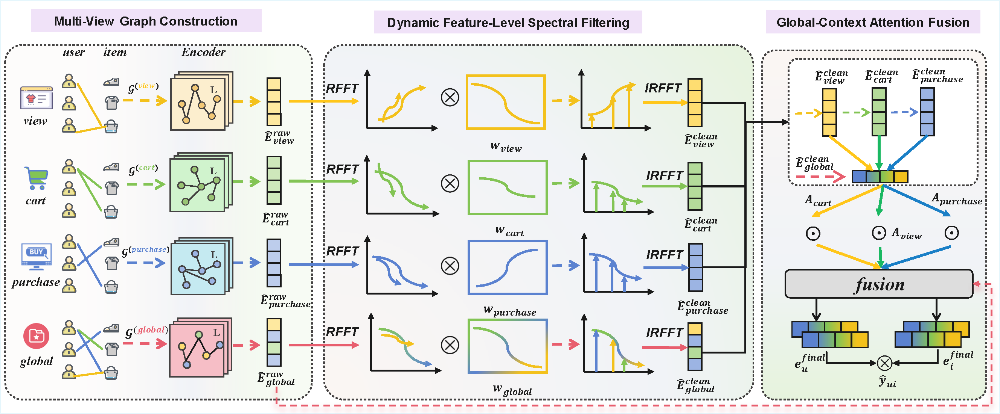

<div align="center">

# SpectraMB: Dynamic Spectral Denoising with Global-Context Attention for Multi-Behavior Recommendation

[](https://arxiv.org/abs/2606.02417)
[](https://doi.org/10.1145/3770855.3818191)
[](https://kdd2026.kdd.org/)
[](https://www.python.org/)
[](https://pytorch.org/)
[](https://github.com/miaomiao-cai2/SpectraMB-KDD2026)

**Official PyTorch implementation of our KDD 2026 paper**
*"Dynamic Spectral Denoising with Global-Context Attention for Multi-Behavior Recommendation"*

[Paper](https://doi.org/10.1145/3770855.3818191) · [arXiv](https://arxiv.org/abs/2606.02417) · [Citation](#-citation)

</div>

## 📖 Overview

<p align="center">
  
</p>
<p align="center"><em>Figure: Overview of SpectraMB. Dynamic Feature-Level Spectral Filtering purifies each behavior view in a feature-frequency space; Global-Context Attention Fusion then uses the purified global representation as an anchor to reliability-weight and aggregate the purified views before target-behavior prediction.</em></p>

## 🔧 Requirements

```
python == 3.9.23
torch == 2.3.1+cu121
numba == 0.60.0
numpy == 1.26.3
pandas == 2.3.2
```

## ⚙️ Installation

```bash
# 1. Clone the repository
git clone https://github.com/miaomiao-cai2/SpectraMB-KDD2026.git
cd SpectraMB-KDD2026

# 2. Create and activate a conda environment
conda create -n spectramb python=3.9.23
conda activate spectramb

# 3. Install dependencies matching the versions above
pip install torch==2.3.1 --index-url https://download.pytorch.org/whl/cu121
pip install numba==0.60.0 numpy==1.26.3 pandas==2.3.2

# 4. Unpack the bundled data archive
python -c "import shutil; shutil.unpack_archive('data.7z', '.')"  # or: 7z x data.7z
```

> A GPU with CUDA 12.1 support is recommended for training at scale. Unpacking `data.7z` requires 7-Zip (`py7zr` or the `7z` CLI) if the Python one-liner above isn't available.

## 📁 Repository Structure

```
SpectraMB-KDD2026/
├── main.py          # Entry point: argument parsing, dataset dispatch, training launch
├── model.py          # SpectraMB model (spectral filtering + global-context attention fusion)
├── lightGCN.py        # Graph backbone encoder
├── trainer.py         # Training loop, evaluation, early stopping
├── data_set.py        # Multi-behavior dataset loading and preprocessing
├── metrics.py          # HR@K, NDCG@K implementations
├── tool.py             # Helper utilities
├── utils.py            # Additional helper functions
├── data.7z            # Archive of multi-behavior interaction data (unpack before training)
└── README.md
```

> Directory descriptions above reflect the current repository layout — feel free to adjust the wording if any file's actual contents differ.

## 📊 Datasets

Experiments are conducted on three widely-used real-world multi-behavior datasets. For Taobao and Tmall, **purchase** is the target behavior and the remaining interaction types (view, collect, cart) are auxiliary. For Movielens-10M, explicit 1–5 ratings are converted into three implicit behaviors — dislike, neutral, and like — with **like** treated as the target behavior.

| Dataset | `--data_name` | Behaviors (`args.behaviors`) | Target behavior |
|---|---|---|---|
| Taobao | `taobao` | view, cart, buy | buy |
| Tmall | `tmall` | click, collect, cart, buy | buy |
| Movielens-10M | `ml` | neutral, neg, pos | pos |

The released code also ships several **perturbed variants** of Taobao/Tmall (e.g., `taobao_add10`, `taobao_delete30`, `tmall_discart`) used for the paper's noise-robustness evaluation, plus a few additional benchmark datasets (`beibei`, `yelp`, `jdata`, `ijcai`) beyond the three reported in the main results. See the `if/elif` block in `main.py` for the complete list of supported `--data_name` values and their expected `data/<name>/` folder layout.

## 🚀 Usage

The commands below match the presets currently included in the repository:

### Taobao

```bash
python main.py --data_name='taobao' --content_coeff=1.25 --processed_global_coeff=0
```

### Movielens-10M

```bash
python main.py --data_name='ml' --content_coeff=1 --processed_global_coeff=1
```

### Tmall

```bash
python main.py --data_name='tmall' --content_coeff=1 --processed_global_coeff=0
```

## 🎛️ Hyperparameters

Default training setup (see `main.py` for the authoritative list):

| Setting | Value |
|---|---|
| Embedding size | 64 |
| Graph layers | 3 |
| Optimizer | Adam, lr = 0.001 |
| Batch size | 1024 |
| Dropout rate | 0.2 |
| L2 weight decay | 1e-3 |
| Loss type | BPR |
| Max epochs / early-stop patience | 200 / 10 |

`--content_coeff` and `--processed_global_coeff` are the two dataset-sensitive coefficients worth tuning first, as shown in the per-dataset examples above.

## 📝 Citation

If you find this work or code useful for your research, please cite our paper:

```bibtex
@inproceedings{cai2026spectramb,
  author    = {Cai, Miaomiao and Ma, Yunshan and Zhu, Fangqi and Fang, Junfeng and Zhang, Zhijie and Cheng, Zhiyong and Wang, Xiang and Ng, See-Kiong},
  title     = {Dynamic Spectral Denoising with Global-Context Attention for Multi-Behavior Recommendation},
  booktitle = {Proceedings of the 32nd ACM SIGKDD Conference on Knowledge Discovery and Data Mining (KDD '26)},
  year      = {2026},
  publisher = {ACM},
  doi       = {10.1145/3770855.3818191}
}
```

## 📄 License

No license file is currently included in this repository. If you intend to release this code under an open-source license (e.g., MIT or Apache-2.0), please add a `LICENSE` file at the repository root — this makes reuse terms explicit for others building on this work.

## 📬 Contact

For questions about the paper or code, please open a [GitHub issue](https://github.com/miaomiao-cai2/SpectraMB-KDD2026/issues).
